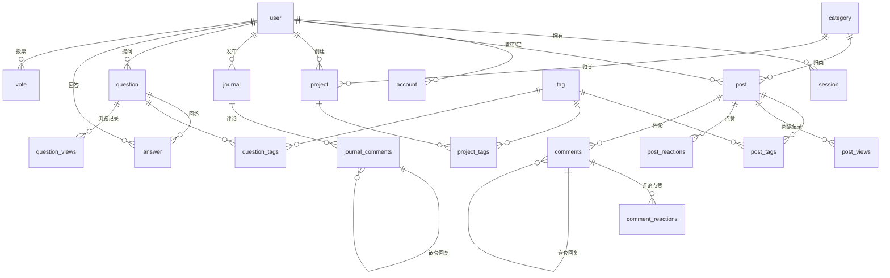

# Tz Blog · 功能介绍与数据库设计

> 一个基于 Next.js 15 + Cloudflare 全家桶构建的个人博客 / 作品集系统。
> 本文档介绍博客的整体设计、页面功能与数据库结构，供他人快速了解项目全貌。

---

## 一、项目概述

Tz Blog 是一个集 **博客文章、随手日志、项目作品集、Q&A** 于一体的个人站点。
它强调端到端类型安全、精致的视觉设计（纯白底 + 冷中性灰 + 可换主题色），并完整跑在 Cloudflare 边缘网络上。

- **公开站点**：文章、日志、项目、归档、关于等页面，支持中英双语。
- **管理后台**：文章、项目、日志、分类、标签、用户的增删改查与富文本编辑。
- **设计系统页**：可视化展示配色、字体、组件规范。

### 技术栈

| 层 | 选型 |
|----|------|
| 框架 | Next.js 15（App Router + Turbopack） |
| 数据库 | Cloudflare D1（SQLite）+ Drizzle ORM |
| 鉴权 | better-auth（邮箱密码 + GitHub + Google + admin 插件） |
| API | tRPC v11 + TanStack Query（端到端类型安全） |
| UI | Tailwind CSS v4 + shadcn/ui（new-york 风格） |
| 富文本编辑器 | Plate.js（`@platejs/*`），部分场景用 Tiptap |
| 国际化 | next-intl（`en` / `zh`，默认 `zh`） |
| URL 状态 | nuqs（表格筛选/分页同步到 URL） |
| 部署 | Cloudflare Workers（OpenNext），自定义域名 `tz1.me` |

---

## 二、站点功能与页面介绍

> 📷 本章每个页面下方的 `` 为截图占位。截图获取方式与文件名见
> [附录 A · 截图清单](#附录-a--截图清单待补充)，按文件名放入 `docs/images/` 即可自动渲染。

### 1. 首页 Home

地址：`/zh`

首页是站点门面，由一个动态 Hero 区与若干内容板块组成：

- **动态问候 + 实时时钟**：根据时段显示「早安 / 午安 / 晚安 / 深夜好」并实时刷新时间。
- **站点统计**：文章总数、累计阅读量（带数字滚动动画）。
- **写作热力图**：仿 GitHub 贡献图，展示过去一年（53 周）的发文活跃度，附「当前连续天数」。
- **主题标签云**：按文章数排序的热门标签，点击可跳转到对应标签的文章列表。
- **精选文章**：基于阅读量的热门文章卡片。
- **最近动态（Streams）**：聚合最新文章与日志的时间流。

---

### 2. 博客列表 Blog

地址：`/zh/blog`

文章列表页，支持：

- 文章卡片（封面、标题、摘要、分类、标签、日期、阅读量）。
- 按分类 / 标签筛选（`/blog?tag=xxx`）。
- 关键字搜索与分页。
- 侧边栏（分类、标签、热门文章等）。

---

### 3. 文章详情 Post Detail

地址：`/zh/blog/[...slug]`

- **Plate.js 富文本渲染**：标题层级、代码块（带高亮）、图片、引用等。
- **阅读量统计**：基于 IP 去重计数。
- **点赞 / 反应**：游客（按 IP）与登录用户均可点赞。
- **评论系统**：支持嵌套回复（父子结构）、评论点赞，登录后可发表。

---

### 4. 归档 Archives

地址：`/zh/archives`

按时间线归档所有文章，便于快速回溯历史内容。

---

### 5. 日志 / 动态 Journals

地址：`/zh/journals`

类似「即刻 / 微博」的轻量动态流：

- 支持纯文本 + 配图的短内容。
- 按日期分组展示（带星期标签）。
- 独立的评论体系（`journal_comments`，支持嵌套回复）。
- 登录用户可直接发布新动态。

---

### 6. 项目 Projects

地址：`/zh/projects`

作品集展示页：

- 项目卡片（封面、标题、描述、标签）。
- 按类型/分类筛选（前端 / 后端 / 移动端 / 工具 / AI / 其他）。
- 每个项目可附 **GitHub 链接、Demo 链接、博客链接**。
- 支持手动排序（`sortOrder`）。

---

### 7. 关于 About

地址：`/zh/about`

个人介绍页，包含动态时间线、经验年数、在线时长时钟等动态元素。

---

### 8. 设计系统 Design System

地址：`/zh/design-system`

可视化设计规范展示页，集中呈现：

- **配色系统**：冷中性灰 `ink-*` 色阶、品牌色、状态色。
- **字体系统**：正文 Geist Sans、装饰标题 Cormorant Garamond。
- **组件规范**：按钮、徽章、表单、卡片等 shadcn 组件用法。

---

### 9. 登录 / 注册 Auth

地址：`/zh/sign-in`、`/zh/sign-up`

基于 better-auth：

- 邮箱 + 密码（注册后自动登录，密码至少 6 位）。
- GitHub / Google 第三方登录。
- 基于角色（admin / user）的权限控制。

---

### 10. 管理后台 Dashboard

地址：`/dashboard`（不走国际化中间件）

管理员专属后台，基于共享的 **数据表系统**（TanStack Table + nuqs URL 状态）：

- **文章管理**：列表、筛选、新建/编辑（Plate.js 编辑器 + 草稿保存）。
- **项目管理**：作品集 CRUD。
- **日志管理**：动态 CRUD。
- **分类 / 标签管理**：维护文章与项目的分类法。
- **用户管理**：用户列表与角色管理。

后台表格统一支持：URL 同步的分页/排序/筛选、列显隐、骨架屏加载、文本/下拉/多选筛选器。

---

### 11. 全站通用功能

| 功能 | 说明 |
|------|------|
| **可换主题色** | 浮动导航的「主题色」弹窗提供 8 种品牌色，选择后写入 `localStorage`，首屏无闪烁注入；联动链接、按钮、Logo、焦点环、图表主色。 |
| **深色模式** | 基于 `next-themes`，`ink-*` 色阶在深色模式下自动反转。 |
| **全局搜索** | 站内搜索组件（`global-search`）。 |
| **国际化** | 中英双语（next-intl），默认中文。 |
| **RSS 订阅** | `/[locale]/rss.xml` 生成 RSS 源。 |
| **浮动导航 + 页脚** | 导航：博客 / 日志 / 项目 / 关于；页脚含隐私政策、服务条款、社交链接。 |
| **图片服务** | 经 `/api/upload`、`/api/images`、R2 存储托管图片。 |
| **AI 辅助** | `/api/ai/copilot`、`/api/ai/command` 为编辑器提供 AI 写作能力。 |

---

## 三、数据库设计

> 本章遵循「**从大局到细节**」的顺序：先用全景图与分域总览建立整体认知，再逐表展开字段细节。

数据库为 **Cloudflare D1（SQLite）**，使用 Drizzle ORM 定义。Schema 按业务域拆分到
`src/server/db/schemas/` 下，再由 `schema.ts` 统一导出。

**通用约定：**

- 所有业务表共用 `commonColumns`（`created_at`、`updated_at`，毫秒时间戳，自动维护）。
- 主键多为 `text` 类型的 UUID（`crypto.randomUUID()`）；浏览/阅读记录类表用自增整型主键。
- 时间戳统一为 `timestamp_ms`（毫秒）。

---

### 3.1 大局 · 数据库全景关系图

下图展示全部数据表及其相互关系。`user`（用户）与 `tag`/`category`（分类法）是被广泛引用的核心实体，
内容（文章 / 项目 / 日志 / 问答）围绕它们展开，互动（评论 / 反应 / 投票 / 浏览）再挂在内容之上。

> 提示：以上为 Mermaid 关系图，GitHub / VS Code / 多数 Markdown 阅读器可直接渲染。
> 若需要位图，可把它粘贴到 <https://mermaid.live> 导出 PNG，放到 `docs/images/db-er.png` 并在此处引用。

---

### 3.2 大局 · 表分域总览

全库共 **22 张表**，按业务域划分如下：

| 业务域 | 数据表 | 职责 |
|--------|--------|------|
| **鉴权** | `user`、`session`、`account`、`verification` | 用户、会话、第三方账户、验证令牌（better-auth 管理） |
| **文章** | `post`、`post_views`、`post_tags`、`post_reactions` | 博客文章及其阅读量、标签、点赞 |
| **项目** | `project`、`project_tags` | 作品集及其标签 |
| **日志** | `journal`、`journal_comments` | 短动态及其评论 |
| **评论互动** | `comments`、`comment_reactions` | 文章评论及评论反应 |
| **问答** | `question`、`answer`、`question_tags`、`question_views`、`vote` | 问题、回答、标签、浏览量、投票 |
| **分类法** | `category`、`tag` | 跨内容类型共享的分类与标签 |
| **统计** | `statistics` | 全站统计快照 |

**核心枚举**（`enums.ts`）：

- 角色：`admin` / `user`
- 文章 / 项目状态：`draft` / `published`
- 反应类型：`like` / `dislike`
- 项目类型：`frontend` / `backend` / `mobile` / `tool` / `ai` / `other`
- 问题状态：`pending` / `approved` / `rejected`
- 投票类型：`upvote` / `downvote`

---

### 3.3 细节 · 逐表详解

以下按业务域逐表说明字段与约束。

#### 3.3.1 鉴权域（better-auth）

由 better-auth 管理，运行 `pnpm auth:generate` 自动生成。

**`user`** — 用户
| 字段 | 类型 | 说明 |
|------|------|------|
| id | text PK | 用户 ID |
| name | text | 昵称 |
| email | text unique | 邮箱 |
| email_verified | boolean | 邮箱是否验证 |
| image | text | 头像 |
| role | text | 角色（admin / user） |
| banned / ban_reason / ban_expires | - | 封禁状态（admin 插件） |
| created_at / updated_at | timestamp | 时间戳 |

**`session`** — 会话：`token`、`expires_at`、`ip_address`、`user_agent`、`user_id`（FK→user，级联删除）、`impersonated_by`。

**`account`** — 第三方/密码账户：`provider_id`、`access_token`、`refresh_token`、`password` 等，`user_id`（FK→user，级联删除）。

**`verification`** — 验证令牌：`identifier`、`value`、`expires_at`。

#### 3.3.2 内容域：文章

**`post`** — 文章
| 字段 | 类型 | 说明 |
|------|------|------|
| id | text PK | 文章 ID |
| title | text | 标题 |
| slug | text unique | URL slug |
| excerpt | text | 摘要 |
| content | text | 正文（Plate.js JSON） |
| image_url | text | 封面 |
| status | enum | `draft` / `published` |
| created_by_id | text FK→user | 作者（索引 `created_by_idx`） |
| category_id | text FK→category | 分类 |

**`post_views`** — 阅读记录（自增 id、`post_id`、`user_id?`、`ip`），用于按 IP 去重统计阅读量。

**`post_tags`** — 文章↔标签 多对多（联合主键 `post_id` + `tag_id`）。

**`post_reactions`** — 文章点赞/反应（`ip`、`user_id?`、`post_id`、`num`、`type`）。

#### 3.3.3 内容域：项目

**`project`**
| 字段 | 类型 | 说明 |
|------|------|------|
| id | text PK | 项目 ID |
| title / description / image_url | text | 标题/描述/封面 |
| category_id | text FK→category | 分类（必填） |
| status | enum | `draft` / `published` |
| github_url / demo_url / blog_url | text | 外链 |
| sort_order | int | 排序 |
| created_by_id | text FK→user | 作者 |

索引：`project_created_by_idx`、`project_category_idx`、`project_status_idx`。

**`project_tags`** — 项目↔标签 多对多（联合主键）。

> 项目类型枚举（前端/后端/移动/工具/AI/其他）定义在 `enums.ts`。

#### 3.3.4 内容域：日志

**`journal`** — 短动态：`author_id`（FK→user，索引 `journal_author_idx`）、`content`、`image_url`。

**`journal_comments`** — 日志评论：`journal_id`（FK→journal，级联删除）、`user_id`、`parent_id`（自引用，支持嵌套回复）、`content`。

#### 3.3.5 互动域：评论与反应

**`comments`** — 文章评论
| 字段 | 类型 | 说明 |
|------|------|------|
| id | text PK | 评论 ID |
| user_id | text FK→user | 评论者 |
| post_id | text FK→post | 所属文章 |
| parent_id | text FK→comments | 父评论（自引用，嵌套回复） |
| content | text | 内容 |

**`comment_reactions`** — 评论反应（联合主键 `user_id` + `comment_id`，`type` 为 like/dislike，`comment_id` 级联删除）。

#### 3.3.6 Q&A 域

**`question`** — 问题：`title`、`content`、`author_id`、`views`、`upvotes`、`downvotes`、`answers`（计数）、`status`（pending/approved/rejected）。索引：作者、状态。

**`answer`** — 回答：`question_id`（FK→question，级联删除）、`author_id`、`content`、`upvotes`、`downvotes`。

**`question_tags`** — 问题↔标签 多对多。

**`question_views`** — 问题浏览记录（按 IP）。

**`vote`** — 投票：`action_id` + `action_type`（question / answer）+ `vote_type`（upvote / downvote），多态关联问题或回答。索引：`vote_action_idx`、`vote_author_idx`。

#### 3.3.7 分类法与统计

**`category`** — 分类：`name`、`description`。被文章与项目共用。

**`tag`** — 标签：`name`（unique）、`description`、`color`（hex）、`icon`（SVG 字符串）。被文章、项目、问题共用。

**`statistics`** — 全站统计快照：`total_posts`、`total_views`、`last_updated`。

### 3.4 关系特征小结

- **一对多**：user → post / project / journal / comment / question / answer；category → post / project。
- **多对多**（中间表）：post↔tag、project↔tag、question↔tag。
- **自引用**：comments、journal_comments 通过 `parent_id` 实现嵌套回复。
- **多态**：vote 通过 `action_type` 关联 question 或 answer。
- **去重统计**：post_views / question_views 按 `ip` 去重计数。

---

## 四、API 设计（tRPC）

所有数据访问通过 tRPC 路由（`src/server/api/routers/`）：

- `post`、`project`、`journal`、`category`、`tag`
- `comment`、`commentReactions`、`journalComment`
- `question`、`answer`

两类过程：`publicProcedure`（任何人，session 可为空）与 `protectedProcedure`（需登录，否则 UNAUTHORIZED）。
开发模式下统一加 100–500ms 随机延迟以暴露请求瀑布。序列化用 superjson。

文章路由的代表性接口：`getByPage` / `getBySlug`（阅读）、`createView`（计阅读）、`postLike`（点赞）、
`getPopular`（热门）、`getActivity`（热力图数据）、`getStatistics`（统计），以及受保护的
`createDraft` / `createWithTags` / `updateWithTags` / `delete`。

---

## 五、部署

- 通过 OpenNext 适配为 Cloudflare Worker：`pnpm preview` 本地预览，`pnpm deploy` 部署。
- 绑定：D1 数据库 `DB`、R2 存储桶 `NEXT_INC_CACHE_R2_BUCKET`、自定义域名 `tz1.me`。
- 迁移：`pnpm db:generate` 生成迁移到 `migrations_productions/`，`pnpm db:migrate` 应用。

---

## 附录 A · 截图清单（待补充）

> 本文「二、站点功能与页面介绍」中已用 `` 占位引用截图。
> 请按下表自行截图，保存到 `docs/images/` 目录、**使用对应文件名**，即可自动在文档中渲染。

**截图规范建议：**

- 浏览器视口宽度 **1440px** 左右（桌面布局），整页或首屏皆可；可隐藏滚动条。
- 本地访问地址：开发服务器 `http://localhost:3000`，语言前缀用 `/zh`。
- 文章详情、后台等需要先有数据 / 登录；后台需用 admin 账号登录后访问。
- 建议导出 PNG，统一放在 `docs/images/`。

| 文件名 | 页面 | 访问地址 | 截图要点 |
|--------|------|----------|----------|
| `home.png` | 首页 | `/zh` | Hero 问候 + 统计 + 写作热力图 + 标签云 + 精选文章 |
| `blog-list.png` | 博客列表 | `/zh/blog` | 文章卡片网格 + 侧边栏 + 筛选/搜索 |
| `blog-detail.png` | 文章详情 | `/zh/blog/<某篇文章 slug>` | 富文本正文 + 代码块 + 点赞 + 评论区 |
| `archives.png` | 归档 | `/zh/archives` | 按时间线归档的文章列表 |
| `journals.png` | 日志/动态 | `/zh/journals` | 按日期分组的动态流 + 评论面板 |
| `projects.png` | 项目 | `/zh/projects` | 项目卡片 + 分类筛选 + 外链 |
| `about.png` | 关于 | `/zh/about` | 个人介绍 + 动态时间线/时钟 |
| `design-system.png` | 设计系统 | `/zh/design-system` | 配色色阶 + 字体 + 组件展示 |
| `sign-in.png` | 登录 | `/zh/sign-in` | 邮箱密码 + GitHub/Google 登录入口 |
| `dashboard.png` | 管理后台 | `/dashboard`（需 admin 登录） | 数据表格 + 侧边栏 + 筛选/分页 |

**可选补充截图：**

| 文件名 | 内容 | 说明 |
|--------|------|------|
| `brand-picker.png` | 主题色弹窗 | 浮动导航「主题色」展开，展示 8 种品牌色 |
| `dark-mode.png` | 深色模式 | 任意页面切换深色后的效果 |
| `dashboard-editor.png` | 文章编辑器 | 后台 Plate.js 富文本编辑界面 |
| `db-er.png` | 数据库关系图 | 将 §3.1 的 Mermaid 图导出为位图（可选） |
